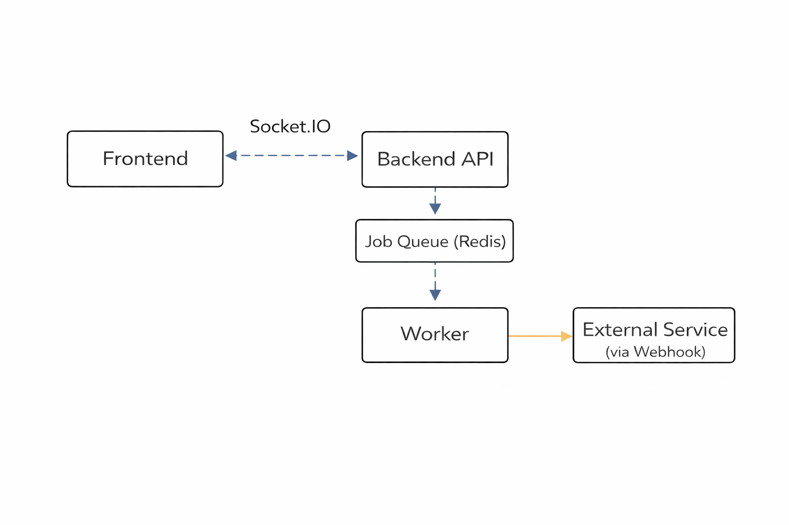

# Credit Request System

A small, multi-country credit request processing system demonstrating a production-like architecture with synchronous validation, asynchronous processing, webhook delivery, and realtime updates.

This repository is a teaching/demo project that implements:

- Credit request creation with country-specific validation and provider checks
- Status transitions with audit/history
- Outbox pattern → producer → BullMQ → worker for async processing
- Webhook delivery persistence and retry
- Realtime frontend updates via Socket.IO
- JWT-based authentication for protected write operations
- Redis caching for read endpoints


## ⚡ Quickest Local Start

Run these three commands to get a local development environment up quickly (uses Docker for Postgres/Redis):

```bash
npm install
npm run infra:up
npm run dev:all
```

## 🧱 First Time Setup

If this is the first time you're setting up the project, run:

```bash
npm run setup
```

### Default dev credentials

- Email: `admin@example.com`
- Password: `password`

## Technologies Used

- Backend
	- Node.js, TypeScript, Express
	- Kysely (typed SQL), PostgreSQL
	- BullMQ (typed-like usage) + Redis
	- Socket.IO for realtime
	- Pino for logging
	- Zod for validation
	- jsonwebtoken + bcryptjs for auth

- Frontend
	- React + Vite + TypeScript
	- Socket.IO client

- Database / Storage
	- PostgreSQL
	- Redis (cache + queue)

- Dev / Infra
	- Docker / docker-compose
	- Kubernetes manifests (examples)


## Architecture

Architecture diagram will be inserted here.

Textual flow:

Frontend → Backend API → PostgreSQL
Backend → Redis/BullMQ → Worker
Worker → Webhook delivery
Backend → Socket.IO → Frontend realtime updates




## Quick Start (Run Locally)

These steps assume you have Docker and Node.js (>=16) installed.

1. Clone the repository

```bash
git clone <repo-url>
cd credit-request-system
```

2. Copy env examples

```bash
cp apps/backend/.env.example apps/backend/.env
cp apps/frontend/.env.example apps/frontend/.env
```

3. Start infrastructure (Postgres + Redis)

```bash
docker-compose up -d
```

4. Apply database migrations

```bash
npm --prefix ./apps/backend install
npm --prefix ./apps/backend run migrate
```

5. Install frontend dependencies

```bash
npm --prefix ./apps/frontend install
```

6. Start backend (dev)

```bash
npm --prefix ./apps/backend run dev
```

7. Start frontend (dev)

```bash
npm --prefix ./apps/frontend run dev
```

8. Open the frontend app in your browser (Vite will print the URL)


## Environment Variables

Important env vars (see `apps/backend/.env.example` and `apps/frontend/.env.example`):

- Backend
	- `DATABASE_URL` - Postgres connection string
	- `REDIS_URL` - Redis connection string
	- `JWT_SECRET` - secret used for signing JWTs (change in production)
	- `CACHE_TTL_SECONDS` - cache TTL for read endpoints
	- `ADMIN_EMAIL` / `ADMIN_PASSWORD` - seeded admin for dev
	- `WEBHOOK_TARGET_URL` - target for webhook delivery (mock endpoint included)

- Frontend
	- `VITE_API_URL` - base URL for API (e.g. http://localhost:4000)
	- `VITE_SOCKET_URL` - Socket.IO URL (e.g. http://localhost:4000)


## API Endpoints

All endpoints are prefixed with `/api`.

 - POST /api/auth/login
	 - Description: login with credentials to receive a JWT.
	 - Auth: public
	 - Body: `{ "email": "<email>", "password": "<password>" }`
	 - Response: `{ "token": "<jwt>", "user": { "id":"...","email":"..." }}`

 - GET /api/credit-requests
	 - Description: list credit requests (supports optional `country_code` and `status` query params)
	 - Auth: public
	 - Response: `{ data: [ { id, applicant_name, status, ... } ] }`

 - GET /api/credit-requests/:id
	 - Description: get credit request details and status history
	 - Auth: public
	 - Response: `{ creditRequest: {...}, history: [...] }`

 - POST /api/credit-requests
	 - Description: create a new credit request
	 - Auth: Bearer JWT required
	 - Body: `{ country_code, applicant_name, document_number, monthly_income, requested_amount, currency }`
	 - Response: created credit request object (201)

 - PATCH /api/credit-requests/:id/status
	 - Description: update the status of a credit request (valid transitions enforced)
	 - Auth: Bearer JWT required
	 - Body: `{ status: 'APPROVED'|'REJECTED'|... , reason?: string }`
	 - Response: `{ creditRequest: updated }`

 - POST /api/mock-external/webhook
	 - Description: mock external webhook receiver used in local testing
	 - Auth: public (for local demo)


## Functional Behavior

 - Country validation rules
	 - Each supported country exposes a validator and policy that determines initial status and whether review is required.

 - Status transitions
	 - The system enforces allowed transitions. Invalid transitions return 400.

 - Asynchronous processing
	 - Writes may produce outbox entries that are processed by the producer and dispatched to BullMQ.
	 - A worker consumes jobs, writes audit logs, and attempts webhook delivery.

 - Webhook flow
	 - Webhook deliveries are persisted with status and response; retries are supported via worker logic.

 - Realtime updates
	 - When credit requests are created or statuses change, backend emits Socket.IO events to connected clients.

 - Caching
	 - GET list and GET detail are cached in Redis for short TTL (default 45s). Cache is invalidated on writes.

 - Authentication
	 - Protected write endpoints require a valid JWT. Use `/api/auth/login` to obtain one.


## Test Scenarios

 - Create a valid credit request (should validate and return 201).
 - Create with invalid document (should return 400).
 - Update status with valid transition (should succeed and emit realtime update).
 - Webhook delivery success (worker persists delivery record).
 - Realtime update case: open frontend list, create via API, verify list updates automatically.
 - Auth protected route: attempt to create without token → 401.
 - Cache: call list twice within TTL → second call should be a cache hit.


## Repository Structure

 - `apps/backend` — Express API, services, migrations, queue producer/worker
 - `apps/frontend` — React + Vite frontend
 - `packages/shared` — shared types and constants
 - `docker-compose.yml` — local infra: Postgres + Redis
 - `k8s/` — example Kubernetes manifests


## Future Improvements

 - Add frontend login UX and secure token storage (HttpOnly cookie)
 - Improve production readiness: HTTPS, rate limiting, secrets management, monitoring
 - Add E2E tests and CI pipelines
 - Harden worker retry policies and observability


## Contact

 For questions or feedback, open an issue or contact the maintainer.

